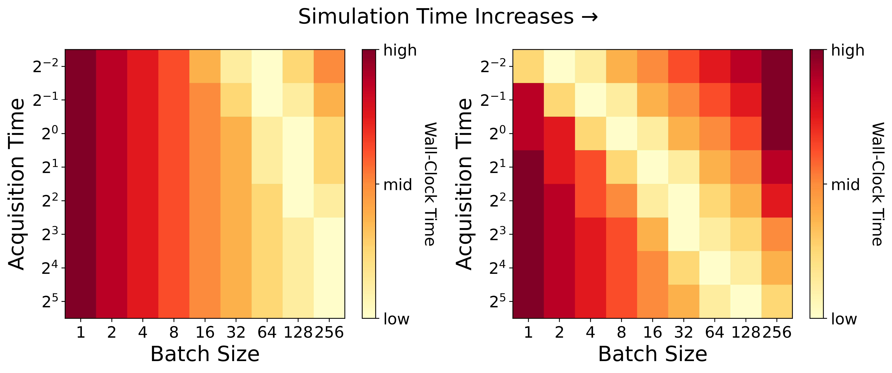
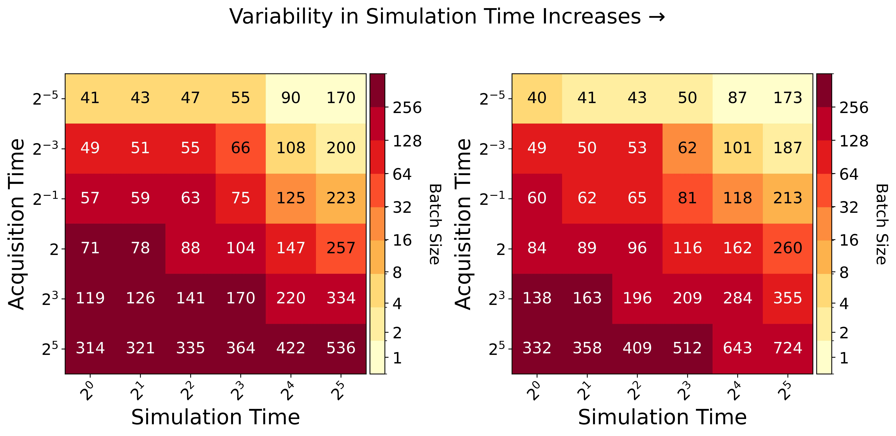

Examples
~~~~~~~~

This example demonstrates how to use the performance model from Sürer and Wild (2024),  
An Active Learning Performance Model for Parallel Bayesian Calibration of Expensive Simulations.

**Instructions for running the illustrative examples with performance model**

To replicate the figures below, respectively:

1) Go to the ``examples/Example3`` directory.

2) Execute any of the following from the command line:

.. code-block:: python

 python example_a.py
 python example_b.py
 
Running each script should not take more than 60 sec. See the figures (jpeg files) saved under ``examples/`` directory.

   

