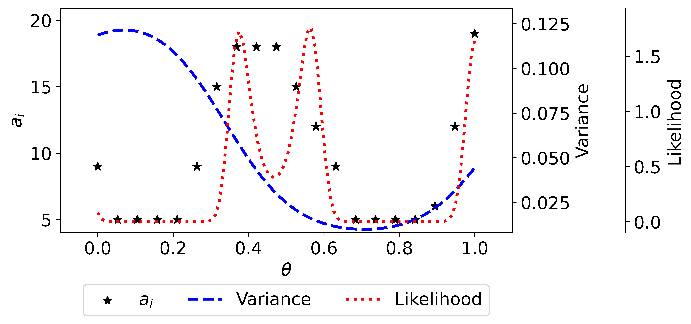

Examples
~~~~~~~~

This example demonstrates how to use the active learning procedure from Sürer (2025),  
Batch Sequential Experimental Design for Calibration of Stochastic Simulation Models,
for the stochastic models with high-dimensional outputs.

**Instructions for running the illustrative examples with the active learning procedure**

To replicate the figures below, respectively:

1) Go to the ``examples/Example4`` directory.

2) Execute any of the following from the command line:

.. code-block:: python

 python toy_example_exploit.py
 python toy_example_explore.py
 
Running this script should not take more than 5 min. See the figures (png files) saved under ``examples/Example4`` directory.

.. image:: toy1.png
   :alt: Illustration of PUQ with the example
   :align: center
   :width: 600
   
Illustration with a simulation model. The red line shows the expected value of the simulation model (left
panel) or the likelihood (middle panel). The blue dashed line shows the prediction mean and the
shaded area illustrates one predictive standard deviation from the mean. Green dots indicate the
simulation data including five replicates of 20 uniformly spaced parameter values used to build
the emulator. The right panel demonstrates the true (black line) and estimated (blue dashed line)
intrinsic variance. 

Allocation of new 100 replicates guided by the proposed acquisition function using the example above.
Star markers indicate the number of replicates on the existing 20 design points. The estimated intrinsic variance (blue
dashed line) and likelihood (red dotted line) are depicted for reference.

.. image:: toy3.png
   :alt: Illustration of PUQ with the example
   :align: center
   :width: 600   
   
Allocation of b = 15 simulation evaluations guided by the IVAR criterion shown in
the first row. The emulator is constructed using simulation data including n0 = 6 unique parameters (black dots),
each replicated five times. The green star represents the acquired point. The second row shows the
true (red line) and estimated likelihood (blue dashed line).
