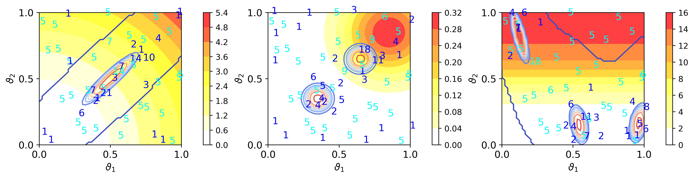

Examples
~~~~~~~~

This example demonstrates how to use the active learning procedure from Sürer (2025),  
Active Learning for Data-Efficient Calibration of Stochastic Simulation Models.

**Instructions for running the illustrative examples with the active learning procedurel**

To replicate the figures below, respectively:

1) Go to the ``examples/Example5`` directory.

2) Execute any of the following from the command line:

.. code-block:: python

 python example.py
 
Running this script should not take more than 5 min. See the figures (jpeg files) saved under ``examples/`` directory.

   
The proposed procedure is illustrated with examples featuring different numbers 
of posterior modes. Contour lines represent the posterior distribution of the 
parameters, while the background color indicates the intrinsic noise.
Cyan markers indicate the points in the initial design, 
while blue markers denote the acquired points, with numbers showing the replications.